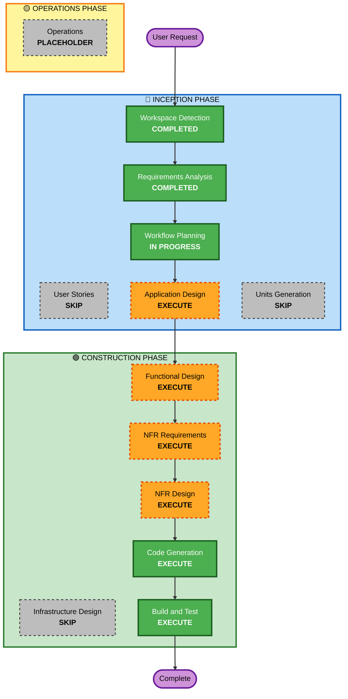

# Execution Plan - Flappy Kiro

## Detailed Analysis Summary

### Project Type
**Greenfield Project** - New web-based game development from scratch

### Change Impact Assessment
- **User-facing changes**: Yes - Complete new game interface and gameplay experience
- **Structural changes**: Yes - New application architecture for game engine
- **Data model changes**: No - Simple in-memory game state, no persistent data
- **API changes**: No - Standalone client-side application
- **NFR impact**: Yes - Performance (60 FPS), usability (responsive controls), accessibility (keyboard-only)

### Risk Assessment
- **Risk Level**: Low
- **Rollback Complexity**: Easy (greenfield project)
- **Testing Complexity**: Simple (isolated game logic, no external dependencies)

---

## Workflow Visualization



---

## Phases to Execute

### 🔵 INCEPTION PHASE
- [x] **Workspace Detection** - COMPLETED
  - Greenfield project confirmed
  - Assets directory identified with game assets
  
- [x] **Requirements Analysis** - COMPLETED
  - Functional requirements documented
  - Non-functional requirements defined
  - Technical constraints identified
  
- [ ] **User Stories** - SKIP
  - **Rationale**: Simple single-player game with clear mechanics; user stories would add minimal value for this straightforward implementation
  
- [x] **Workflow Planning** - IN PROGRESS
  - Execution plan being created
  
- [ ] **Application Design** - EXECUTE
  - **Rationale**: Need to define game architecture components (game loop, player, walls, collision detection, state management, rendering)
  - **Artifacts**: Component identification, service layer design, component methods
  
- [ ] **Units Generation** - SKIP
  - **Rationale**: Single cohesive game application; no need to decompose into multiple units of work

### 🟢 CONSTRUCTION PHASE
- [ ] **Functional Design** - EXECUTE
  - **Rationale**: Need detailed design for game physics, collision detection algorithms, scoring logic, and state transitions
  - **Artifacts**: Data models (game state, player, walls), business logic design, state machine
  
- [ ] **NFR Requirements** - EXECUTE
  - **Rationale**: Performance requirements (60 FPS) and tech stack decisions need assessment
  - **Artifacts**: Performance targets, browser compatibility matrix, rendering strategy
  
- [ ] **NFR Design** - EXECUTE
  - **Rationale**: Need to incorporate performance patterns (requestAnimationFrame, efficient collision detection) and accessibility features
  - **Artifacts**: Performance optimization patterns, accessibility implementation
  
- [ ] **Infrastructure Design** - SKIP
  - **Rationale**: Client-side only application with no server infrastructure, deployment, or cloud services
  
- [ ] **Code Generation** - EXECUTE (ALWAYS)
  - **Rationale**: Implementation of game logic, rendering, and user interface
  - **Artifacts**: HTML structure, JavaScript game engine, CSS styling
  
- [ ] **Build and Test** - EXECUTE (ALWAYS)
  - **Rationale**: Verify game mechanics, collision detection, scoring, and cross-browser compatibility
  - **Artifacts**: Build instructions, test instructions, verification checklist

### 🟡 OPERATIONS PHASE
- [ ] **Operations** - PLACEHOLDER
  - **Rationale**: Future deployment and monitoring workflows (currently out of scope)

---

## Estimated Timeline

- **Total Stages to Execute**: 7 stages
- **Estimated Duration**: 2-3 hours for complete implementation
- **Complexity**: Low - straightforward game mechanics with clear requirements

---

## Success Criteria

### Primary Goal
Create a fully functional Flappy Bird clone (Flappy Kiro) that runs smoothly in web browsers

### Key Deliverables
1. HTML file with game canvas and UI elements
2. JavaScript game engine with all mechanics implemented
3. CSS styling for clean, minimalist appearance
4. Integrated sound effects (jump, game over)
5. Pause functionality
6. Start menu and game over screens
7. Working collision detection and scoring system

### Quality Gates
1. Game runs at stable 60 FPS
2. Controls are responsive (< 50ms input lag)
3. Collision detection is accurate
4. Score tracking works correctly
5. Sound effects play at appropriate times
6. Pause/resume functionality works
7. Game can be restarted cleanly
8. Code is modular and well-commented
9. Cross-browser compatible (Chrome, Firefox, Safari, Edge)
10. Keyboard-only controls work perfectly

---

## Technical Approach

### Architecture Pattern
- **Game Loop Pattern**: requestAnimationFrame for smooth 60 FPS rendering
- **State Machine**: Menu → Playing → Paused → GameOver states
- **Component-Based**: Separate modules for Player, Walls, CollisionDetector, ScoreManager, AudioManager

### Key Technical Decisions
1. **Rendering**: HTML5 Canvas 2D context
2. **Game Loop**: requestAnimationFrame for consistent frame timing
3. **Physics**: Simple gravity and velocity calculations
4. **Collision**: Bounding box collision detection
5. **Audio**: HTML5 Audio API for sound effects
6. **State Management**: Simple state machine with transition logic

### File Structure
```
/
├── index.html          # Game structure and canvas
├── game.js             # Main game engine and logic
├── style.css           # Minimal styling
└── assets/
    ├── ghosty.png      # Player sprite
    ├── jump.wav        # Jump sound effect
    └── game_over.wav   # Game over sound effect
```

